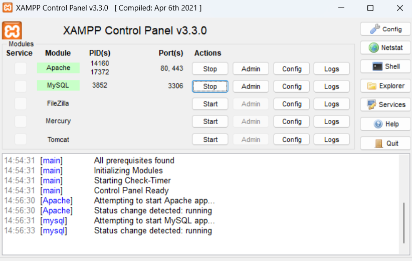
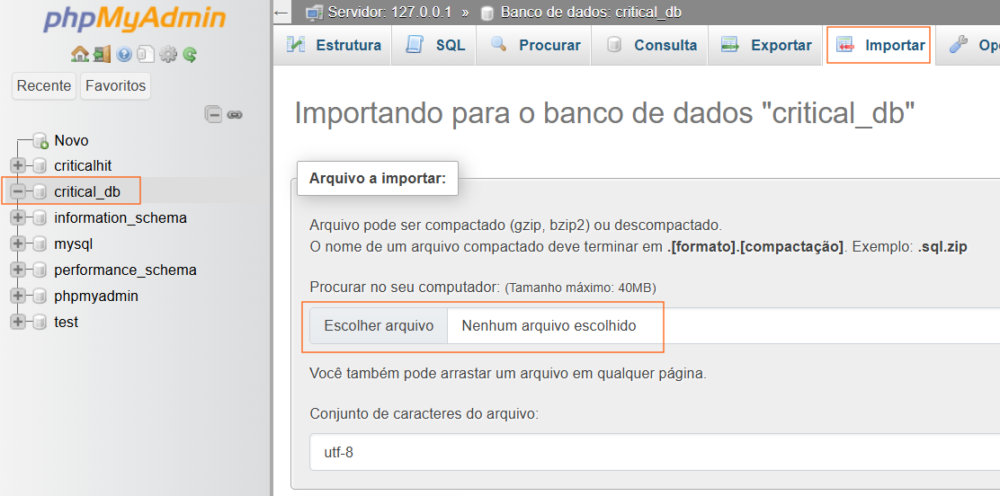

# criticalhit 🕹️🎮🖥️

## 🎯 Sobre o Projeto

O **CriticalHit** é uma plataforma de avaliações de jogos eletrônicos focada em capturar e compartilhar a experiência de cada jogador. Nosso objetivo é oferecer análises autênticas e detalhadas, permitindo que a comunidade descubra novos títulos e tome decisões informadas com base em opiniões reais.

---

## 🧑‍💻 Colaboradores

FELIPE DE SOUZA MIRANDA,
MAYKON DA SILVA FERREIRA e 
DIEGO ALBERTINO DA SILVA RODRIGUES

---

## 🚀 Começando: Guia de Instalação e Execução

Siga estes passos para configurar e visualizar o projeto em seu ambiente local:

### 1. 📦 Instale o XAMPP

Utilizamos o **XAMPP** como servidor local (Apache) e para gerenciamento de banco de dados (MySQL). Ele simula um ambiente de hospedagem web no seu computador.

- **Download:** Você pode baixar o instalador para Windows aqui:
  ```
  https://sourceforge.net/projects/xampp/files/XAMPP%20Windows/8.2.12/xampp-windows-x64-8.2.12-0-VS16-installer.exe
  ```
- **Instalação:** Siga as instruções do instalador. Recomenda-se manter o diretório de instalação padrão (`C:\xampp`).

### 2. 📁 Navegue até a Pasta `htdocs`

Após instalar o XAMPP, abra o seu terminal (Prompt de Comando, PowerShell ou Git Bash) e navegue até a pasta `htdocs` dentro do diretório de instalação do XAMPP.

- **Comando (Exemplo Windows):**
  ```bash
  cd C:\xampp\htdocs\
  ```

### 3. 📥 Clone o Repositório

Dentro da pasta `htdocs`, use o Git para clonar este repositório. Isso baixará todos os arquivos do projeto para uma nova pasta chamada `CriticalHit`.

- **Comando:**
  ```bash
  git clone https://github.com/diego-albertino/CriticalHit.git
  ```

### 4. ▶️ Inicie os Serviços no XAMPP Control Panel

- Abra o `XAMPP Control Panel` (você pode encontrá-lo no Menu Iniciar ou na pasta de instalação do XAMPP).
- Clique no botão `Start` ao lado dos módulos:

  - **Apache** (Servidor Web)
  - **MySQL** (Banco de Dados)

  

### 5. 🌐 Acesse no Navegador

Com os serviços rodando, abra seu navegador de preferência e digite a seguinte URL na barra de endereços:

- **URL:**
  ```
  http://localhost/criticalhit/
  ```

### 6. ✅ Explore o Site!

Se tudo correu bem, a URL acima o levará à página principal do CriticalHit. Agora você pode explorar o site!

---

## ✨ Funcionalidades Atuais

Ao acessar o site, você poderá:

- 🔑 **Fazer Login:** Criar um usuário e faça o login.
- 🎠 **Explorar o Carrossel:** Visualizar destaques e jogos.
- 👉 **Navegar para Páginas de Jogos:** Clicar em um jogo para ver detalhes.
- 💬 **Comentar e Avaliar:** Deixar sua opinião e avaliação na página de um jogo específico.

---

## 💾 Configuração do Banco de Dados (Necessário para Login)

⚠️ **Atenção:** A funcionalidade de **Login/Registro** só funcionará após a configuração correta do banco de dados. Siga os passos abaixo:

1.  **🖥️ Acesse o phpMyAdmin:**

    - Com o Apache e MySQL iniciados no XAMPP, abra seu navegador e acesse:
      ```
      http://localhost/phpmyadmin/
      ```

2.  **➕ Crie um Novo Banco de Dados:**

    - Na interface do phpMyAdmin, clique em `Novo` (ou `New`) no menu lateral esquerdo.
    - No campo "Nome do banco de dados", digite um nome (por exemplo, `criticalhit_db`). **Lembre-se deste nome!**
    - Clique em `Criar` (ou `Create`).

3.  **📤 Importe a Estrutura e Dados:**

    - Selecione o banco de dados que você acabou de criar na lista à esquerda.
    - Clique na aba `Importar` (ou `Import`) no menu superior.
    - Na seção "Arquivo a importar", clique em `Escolher arquivo` (ou `Choose File`).
    - Navegue até a pasta do projeto (`C:\xampp\htdocs\CriticalHit`) e selecione o arquivo `criticalhit.sql`.
    - Role para baixo e clique no botão `Executar` (ou `Go`).

    

✅ **Pronto!** Após a importação bem-sucedida, o banco de dados estará configurado e a funcionalidade de login deverá funcionar corretamente no site.
