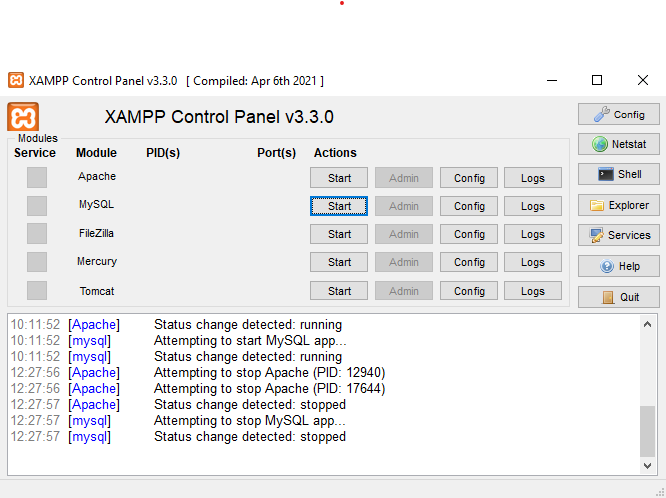
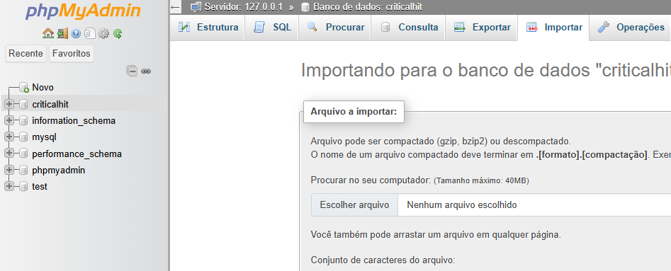

# criticalhit 🕹️🎮🖥️

## 🎯 Sobre o Projeto

O **CriticalHit** é uma plataforma de avaliações de jogos eletrônicos focada em capturar e compartilhar a experiência de cada jogador. Nosso objetivo é oferecer análises autênticas e detalhadas, permitindo que a comunidade descubra novos títulos e tome decisões informadas com base em opiniões reais.

---

## 🧑‍💻 Colaboradores

- FELIPE DE SOUZA MIRANDA

- MAYKON DA SILVA FERREIRA

- DIEGO ALBERTINO DA SILVA RODRIGUES

---

## 🚀 Começando: Guia de Instalação e Execução

Siga estes passos para configurar e visualizar o projeto em seu ambiente local:

### 1. 📦 Instale o XAMPP

Utilizamos o **XAMPP** como servidor local (Apache) e para gerenciamento de banco de dados (MySQL). Ele simula um ambiente de hospedagem web no seu computador.

- **Download:** Você pode baixar o instalador para Windows aqui:
  ```
  https://sourceforge.net/projects/xampp/files/XAMPP%20Windows/8.2.12/xampp-windows-x64-8.2.12-0-VS16-installer.exe
  ```
- **Instalação:** Siga as instruções do instalador. Recomenda-se manter o diretório de instalação padrão (`C:\xampp`).

### 2. 📁 Navegue até a Pasta `htdocs`

Após instalar o XAMPP, abra o seu terminal (Prompt de Comando, PowerShell ou Git Bash) e navegue até a pasta `htdocs` dentro do diretório de instalação do XAMPP.

- **Comando (Exemplo Windows):**
  ```bash
  cd C:\xampp\htdocs\
  ```

### 3. 📥 Clone o Repositório

Dentro da pasta `htdocs`, use o Git para clonar este repositório. Isso baixará todos os arquivos do projeto para uma nova pasta chamada `CriticalHit`.

- **Comando:**
  ```bash
  git clone https://github.com/diego-albertino/CriticalHit.git
  ```

### 4. ▶️ Inicie os Serviços no XAMPP Control Panel

- Abra o `XAMPP Control Panel` (você pode encontrá-lo no Menu Iniciar ou na pasta de instalação do XAMPP).
- Clique no botão `Start` ao lado dos módulos:

  - **Apache** (Servidor Web)
  - **MySQL** (Banco de Dados)

  

### 5. 💾 Configuração do Banco de Dados

> ⚠️ **Importante:**  
> Para garantir o funcionamento correto do site, **certifique-se de importar o banco de dados** antes de acessar o sistema.  
> Sem essa etapa, funcionalidades essenciais como login e cadastro não estarão disponíveis.

Siga os passos abaixo para configurar o banco de dados:

1.  **🖥️ Acesse o phpMyAdmin:**

    - Com o Apache e MySQL iniciados no XAMPP, abra seu navegador e acesse:
      ```
      http://localhost/phpmyadmin/
      ```

2.  **➕ Crie um Novo Banco de Dados:**

    - Na interface do phpMyAdmin, clique em `Novo` (ou `New`) no menu lateral esquerdo.
    - No campo "Nome do banco de dados", digite um nome (por exemplo, `criticalhit_db`). **Lembre-se deste nome!**
    - Clique em `Criar` (ou `Create`).

3.  **📤 Importe a Estrutura e Dados:**

    - Selecione o banco de dados que você acabou de criar na lista à esquerda.
    - Clique na aba `Importar` (ou `Import`) no menu superior.
    - Na seção "Arquivo a importar", clique em `Escolher arquivo` (ou `Choose File`).
    - Navegue até a pasta do projeto (`C:\xampp\htdocs\CriticalHit`) e selecione o arquivo `criticalhit.sql`.
    - Role para baixo e clique no botão `Executar` (ou `Go`).

    

✅ **Pronto!** Após a importação bem-sucedida, o banco de dados estará configurado e a funcionalidade de login deverá funcionar corretamente no site.

### 6. 🌐 Acesse no Navegador

Com os serviços rodando, abra seu navegador de preferência e digite a seguinte URL na barra de endereços:

- **URL:**
  ```
  http://localhost/criticalhit/
  ```

### 7. ✅ Explore o Site!

Se tudo correu bem, a URL acima o levará à página principal do CriticalHit. Agora você pode explorar o site!

---

## ✨ Funcionalidades Atuais

A plataforma CriticalHit foi desenvolvida com um conjunto robusto de funcionalidades para garantir uma experiência completa tanto para jogadores quanto para administradores.

### Para Usuários (Clientes)

- 🔑 **Autenticação Segura:** Crie uma conta de forma rápida e faça login com segurança. As senhas são criptografadas para garantir a proteção dos seus dados.

- 🎠 **Descoberta Intuitiva:** Explore os jogos através de carrosséis interativos na página inicial, facilitando a descoberta de novos títulos.

- 🔎 **Busca de Críticas:** Utilize a barra de pesquisa para encontrar críticas por palavras-chave. Os resultados permitem visualizar e gerenciar os comentários encontrados.

- 📄 **Páginas de Jogo:** Acesse uma página dedicada para cada jogo, contendo informações como capa, descrição, plataforma e a nota média calculada a partir das avaliações da comunidade.

- 💬 **Avaliação e Comentários:** Compartilhe sua opinião! Deixe um comentário detalhado e atribua uma nota de 1 a 5 estrelas para qualquer jogo da plataforma.

- 📝 **Solicitação de Novos Jogos:** Não encontrou um jogo? Envie uma solicitação para que os administradores o adicionem ao catálogo.

- 🧑‍🎨 **Perfil Personalizável:** Gerencie sua conta em uma área de perfil dedicada, onde é possível alterar seu nome de usuário, e-mail e escolher entre 15 avatares exclusivos para personalizar sua identidade no site.

### Para Administradores

> Para testar as funcionalidades de administrador, utilize o perfil:  
> **Usuário:** `admin`  
> **Senha:** `admin`

- 🛡️ **Moderação de Conteúdo:** Tenha controle total sobre a comunidade. Administradores podem remover qualquer comentário diretamente da página do jogo, garantindo um ambiente respeitoso.

- ⚙️ **Gerenciamento de Solicitações:** Acesse um painel exclusivo para visualizar todas as solicitações de novos jogos feitas pelos usuários. A partir dali, é possível aprovar ou excluir cada pedido.

- 🔌 **Inclusão de Jogos via API da IGDB:** Ao aprovar uma solicitação, o administrador utiliza uma ferramenta integrada que busca o jogo na API da **IGDB (Internet Game Database)**. É possível selecionar o jogo correto a partir dos resultados da busca e, com um clique, importar automaticamente seu nome, capa, descrição e plataformas para o banco de dados do CriticalHit.

- 🗑️ **Gerenciamento Avançado de Críticas:** Na página de busca, administradores têm permissão para editar ou excluir diretamente qualquer crítica listada nos resultados.
